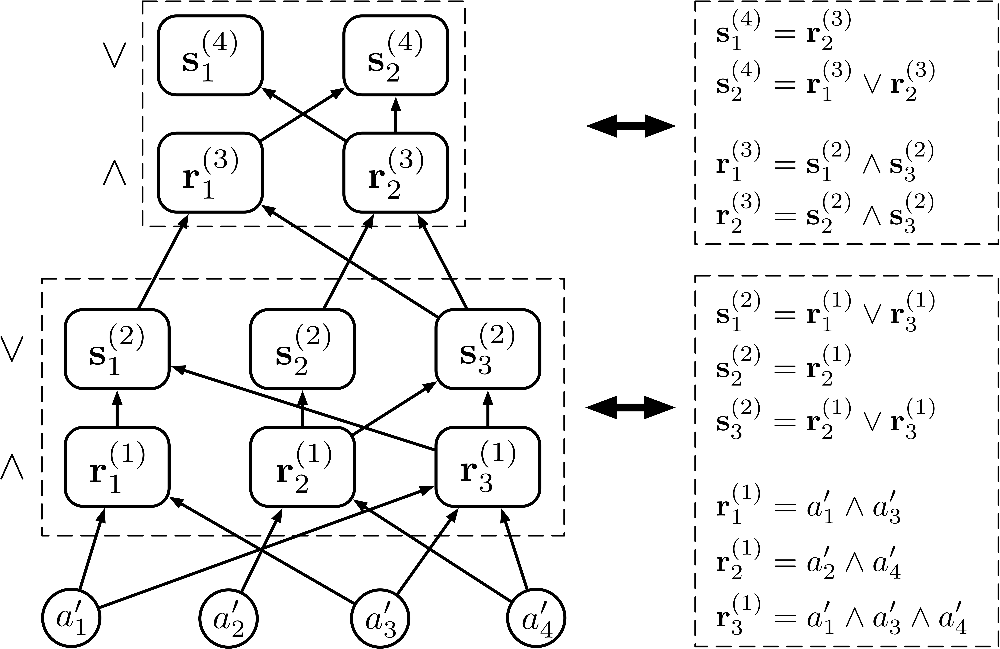
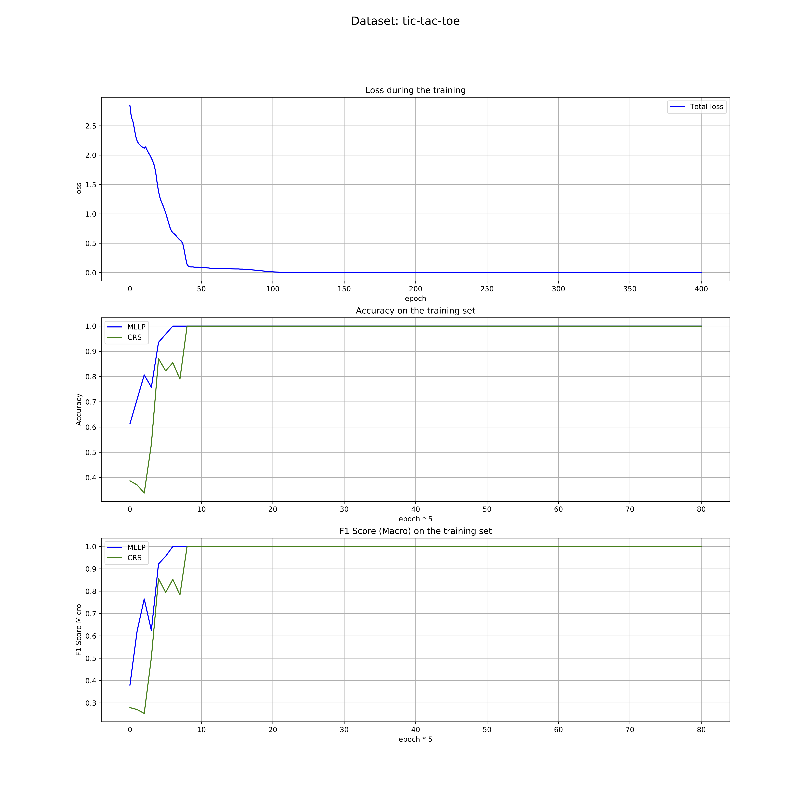

# Multilayer Logical Perceptrons
This is a PyTorch implementation of Multilayer Logical Perceptrons (MLLP) and Random Binarization (RB) method to learn Concept Rule Sets (CRS) for transparent classification tasks, as described in our paper:
[Transparent Classification with Multilayer Logical Perceptrons and Random Binarization](https://arxiv.org/abs/1912.04695).

<p align="center">
  
</p>

If you want a model with a transparent inner structure (good interpretability) and high classification performance, our code may be useful for you. CRS is a hierarchical rule set model, which is transparent and interpretable. We can use gradient descent to learn the discrete CRS via continuous MLLP and the RB method efficiently.

## Installation

Clone the repository and run:
```bash
python3 setup.py install
```

## Requirements

* torch>=1.0.1
* torchvision>=0.2.2
* sklearn>=0.21.2
* numpy>=1.16.3
* pandas>=0.24.2
* matplotlib>=3.0.0
* CUDA (optional, for running on GPU)

## Run the demo
#### UCI data sets
We put 12 UCI data sets in the `dataset` folder. The description of these data sets are listed in [DataSetDesc](dataset/README.md). 

You can specify one data set in the `dataset` folder and train the model as follows:

```bash
# tic-tac-toe data set
python3 experiments.py -d tic-tac-toe &
```
The demo will read the data set and data set information first, then discrete and binarize the data. 

After data preprocessing, the demo will train the MLLP on the training set. The training log file (`log.txt`) can be found in the `log_folder`. During the training, you can check the training loss and the evaluation result on the validation set (or training set) by:
```bash
tail -f log_folder/tic-tac-toe_k5_ki0_useValidationSetFalse_e401_bs64_lr0.01_lrdr0.75_lrde100_wd0.0_p0.0_useNOTFalse_L64/log.txt
```
After training, the evaluation result on the test set is shown at the end of `log.txt`:
```
[INFO] - ============================================================
[INFO] - Test:
	Accuracy of MLLP Model: 0.9895833333333334
	Accuracy of CRS  Model: 1.0
[INFO] - Test:
	F1 Score of MLLP Model: 0.989158667419537
	F1 Score of CRS  Model: 1.0
[INFO] - ============================================================
```

The figure of training loss is shown in `plot_file.pdf`.


Moreover, the trained MLLP model is save in `model.pth`, and the extracted CRS is printed in `crs.txt`:
```
class_negative:
       r1,6:	 [' 2_o', ' 5_o', ' 8_o']
      r1,16:	 [' 7_o', ' 8_o', ' 9_o']
      r1,20:	 [' 1_o', ' 5_o', ' 9_o']
      r1,24:	 [' 1_x', ' 2_o', ' 3_x', ' 6_x', ' 7_o', ' 9_o']
      r1,27:	 [' 1_o', ' 4_o', ' 7_o']
      r1,39:	 [' 3_x', ' 4_x', ' 6_o', ' 7_o', ' 8_x', ' 9_x']
      r1,40:	 [' 2_x', ' 3_o', ' 5_o', ' 6_x', ' 8_o', ' 9_x']
      r1,48:	 [' 4_o', ' 5_o', ' 6_o']
      r1,50:	 [' 3_o', ' 6_o', ' 9_o']
      r1,55:	 [' 1_x', ' 4_o', ' 6_x', ' 7_x', ' 8_x', ' 9_o']
      r1,58:	 [' 1_o', ' 2_x', ' 4_x', ' 6_o', ' 8_o', ' 9_x']
      r1,60:	 [' 3_o', ' 5_o', ' 7_o']
      r1,62:	 [' 1_o', ' 2_o', ' 3_o']
class_positive:
       r1,3:	 [' 3_x', ' 5_x', ' 7_x']
       r1,5:	 [' 2_x', ' 5_x', ' 8_x']
      r1,26:	 [' 1_x', ' 2_x', ' 3_x']
      r1,29:	 [' 7_x', ' 8_x', ' 9_x']
      r1,37:	 [' 3_x', ' 6_x', ' 9_x']
      r1,38:	 [' 4_x', ' 5_x', ' 6_x']
      r1,51:	 [' 1_x', ' 4_x', ' 7_x']
      r1,52:	 [' 1_x', ' 5_x', ' 9_x']
```

The `2_o` denotes the second square is o. The  `r1,6:  [' 2_o', ' 5_o', ' 8_o']` denotes the rule .  
The rule set  and  are used for label prediction.

Try another data set with more specified arguments:

```bash
# adult data set
# You'd better run it on GPU for training large network on CPU may cost lots of time.
python3 experiments.py -d adult -e 800 -bs 64 -lr 0.005 -p 0.9 --use_not --use_validation_set -s 256_256_64 &
```
If GPU is available, the demo will run on GPU automatically.

#### Your own data sets

You can use the demo to train MLLP and CRS on your own data set by putting the data and data information files in the `dataset` folder. Please read [DataSetDesc](dataset/README.md) for a more specific guideline.

#### Available arguments
List all the available arguments and their default values by:
```bash
$ python3 experiments.py --help
usage: experiments.py [-h] [-d DATA_SET] [-k KFOLD] [-ki ITH_KFOLD]
                      [--use_validation_set] [-e EPOCH] [-bs BATCH_SIZE]
                      [-lr LEARNING_RATE] [-lrdr LR_DECAY_RATE]
                      [-lrde LR_DECAY_EPOCH] [-wd WEIGHT_DECAY]
                      [-p RANDOM_BINARIZATION_RATE] [--use_not] [-s STRUCTURE]

optional arguments:
  -h, --help            show this help message and exit
  -d DATA_SET, --data_set DATA_SET
                        Set the data set for training. All the data sets in
                        the dataset folder are available. (default: tic-tac-
                        toe)
  -k KFOLD, --kfold KFOLD
                        Set the k of K-Folds cross-validation. (default: 5)
  -ki ITH_KFOLD, --ith_kfold ITH_KFOLD
                        Do the i-th validation, 0 <= ki < k. (default: 0)
  --use_validation_set  Use the validation set for parameters tuning.
                        (default: False)
  -e EPOCH, --epoch EPOCH
                        Set the total epoch. (default: 401)
  -bs BATCH_SIZE, --batch_size BATCH_SIZE
                        Set the batch size. (default: 64)
  -lr LEARNING_RATE, --learning_rate LEARNING_RATE
                        Set the initial learning rate. (default: 0.01)
  -lrdr LR_DECAY_RATE, --lr_decay_rate LR_DECAY_RATE
                        Set the learning rate decay rate. (default: 0.75)
  -lrde LR_DECAY_EPOCH, --lr_decay_epoch LR_DECAY_EPOCH
                        Set the learning rate decay epoch. (default: 100)
  -wd WEIGHT_DECAY, --weight_decay WEIGHT_DECAY
                        Set the weight decay (L2 penalty). (default: 0.0)
  -p RANDOM_BINARIZATION_RATE, --random_binarization_rate RANDOM_BINARIZATION_RATE
                        Set the rate of random binarization. It is important
                        for CRS extractions from deep MLLPs. (default: 0.0)
  --use_not             Use the NOT (~) operator in logical rules. It will
                        enhance model capability but make the CRS more
                        complex. (default: False)
  -s STRUCTURE, --structure STRUCTURE
                        Set the structure of network. Only the number of nodes
                        in middle layers are needed. E.g., 64, 64_32_16. The
                        total number of middle layers should be odd. (default: 64)

```

## Tutorial
You can use the mllp package in your code easily after installation. 

The tutorial is shown in the jupyter notebook [tutorial.ipynb](tutorial.ipynb).

## Citation

If our work is helpful to you, please kindly cite our paper as:

```
@article{wang2019transparent,
  title={Transparent Classification with Multilayer Logical Perceptrons and Random Binarization},
  author={Wang, Zhuo and Zhang, Wei and Liu, Ning and Wang, Jianyong},
  journal={arXiv preprint arXiv:1912.04695},
  year={2019}
}
```

## License

[MIT license](LICENSE)